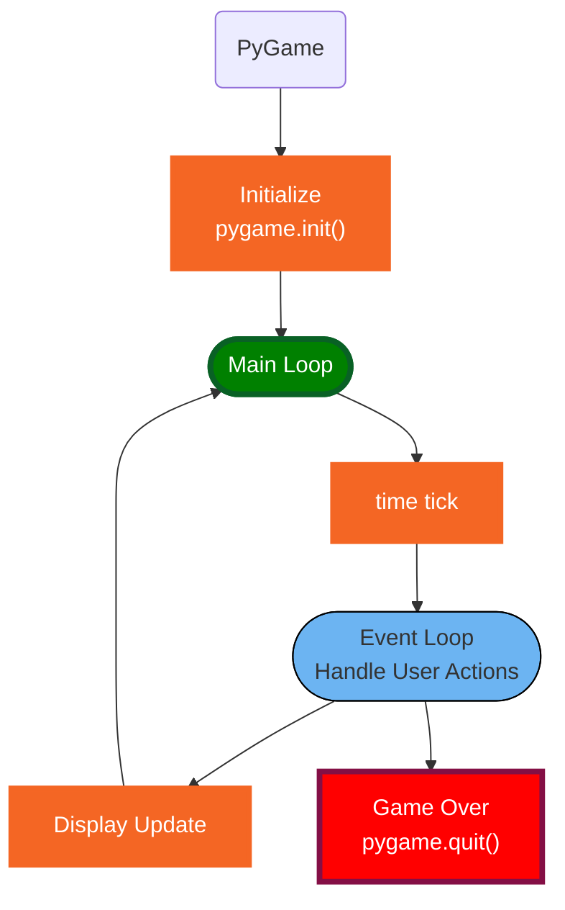
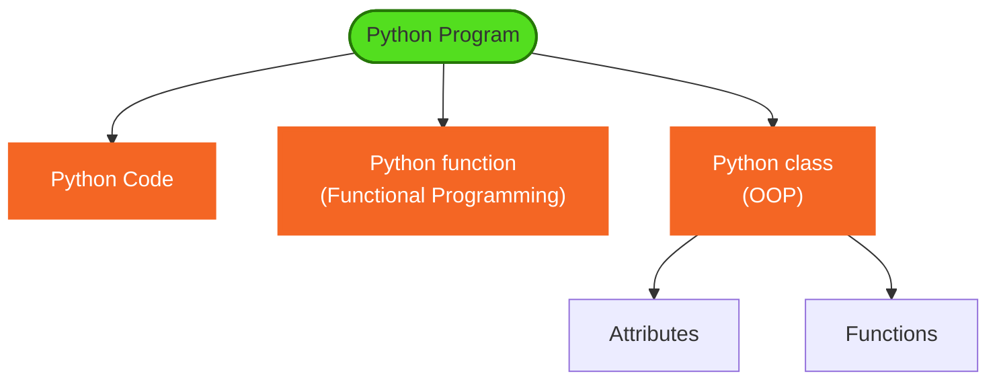

<h1>PyGame Learning Notes</h1>

- [create a virtual environment](#create-a-virtual-environment)
- [install pygame](#install-pygame)
- [getting start](#getting-start)
- [Game Basics](#game-basics)
  - [load ans display image](#load-ans-display-image)
  - [moving image](#moving-image)
  - [Play Sound](#play-sound)
- [Understand Rect](#understand-rect)
  - [Resize the rectangle](#resize-the-rectangle)
  - [Union and Clip](#union-and-clip)
  - [Move Rect by Mouse](#move-rect-by-mouse)
  - [Move Rect automatically bounced on window edge](#move-rect-automatically-bounced-on-window-edge)
  - [use ```collidepoint()```](#use-collidepoint)
  - [find collide rects](#find-collide-rects)

## create a virtual environment
```dos
python -m venv env
```

## install pygame
```dos
pip install pygame
```

## getting start
* [Open a game window](../src/openWindow.py)
* [add time ticker](../src/addTicker.py)

🔑⚡️ **Knowlodge Base:**

1. initialize window
2. time ticker
3. main loop
4. how to terminate the application(handle event)

❓ What is an event?
✔️ key click; mouse moving; mouse click


## Game Basics
### load ans display image
* [display an image](../src/image1.py)
* [resize the image](../src/image2.py)
* [rotate the image](../src/image3.py)
* [loadImage function, use OS path](../src/image4.py)

❓What is ```blit()```?
✔️```blit()``` - blit stands for BLock Image Transfer - it's going to copy the contents of one Surface onto another Surface. The two surfaces are screen that you created and a new Surface. blit() will take that rectanglar surface and put it on top of the screen

### moving image
* [Move image on one direction](../src/moveImage.py)
* [Bounce the image on window side](../src/moveImage2.py)

### Play Sound
* [play music while moving image](../src/moveImageSound.py)
* [handle punch mouse click event](../src/moveImageSoundPunch.py)

## Understand Rect
[Create and display a rectangle](../src/rect1.py)

❓What is ```flip()```?
✔️ ```flip()``` updates the entire Surface on the display. it is similar to ```pygame.display.update()```.

[9 attributes on rect](../src/rect2.py)
1. ```eval()``` is a built in function evaluate string which is variable name return its related object value
2. a rectangle has 9 built in position attributes
3. draw a circle



🔑⚡️ **Knowlodge Base:**

👎😢it is too bad we cannot override function from import❗️
[👎😢no button click works](../src/rect4.py)
👍😄it works on class function.

[👍😄button click works](../src/rect3.py)

### Resize the rectangle

[Resize by ```inflate_ip``` function](../src/rect5.py)

### Union and Clip
[use ```union()``` and clip on two ```Rect``` and ```move_ip()```](../src/rect6.py)

### Move Rect by Mouse
[Move Rect by mouse, using ```move_ip()```](../src/rect7.py)

### Move Rect automatically bounced on window edge
[Change Rect position by timer](../src/rect8.py)

### use ```collidepoint()```
[display red spots in rect](../src/rect9.py)

### find collide rects
[Good for memory game](../src/rect11.py)